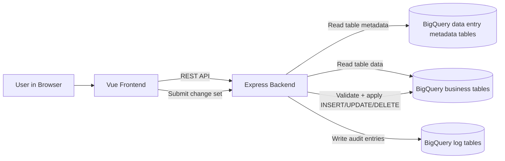
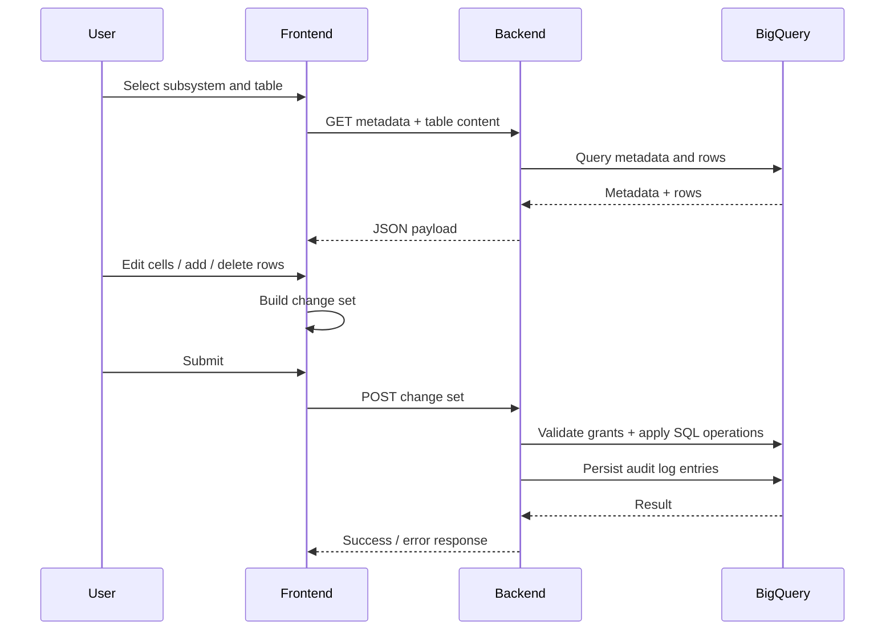

# Lightweight DB Data Entry Showcase

A lightweight full-stack demo for controlled data maintenance in BigQuery.

This repository shows how business users can review, edit, validate, and submit table updates through a browser UI while enforcing schema-based checks and backend audit logging.

## Why this project

- Enable safe, low-friction updates to reference and planning tables.
- Keep data edits transparent with change logs.
- Avoid granting direct database UI access to every end user.
- Provide a starting point that teams can adapt to their own data model.

## What is included

- Vue 3 frontend for table browsing, editing, validation, and upload checks.
- Node.js backend for metadata-driven table access and update processing.
- BigQuery SQL templates for metadata model (data entry pattern) and demo views.
- Terraform sample for basic GCP infrastructure bootstrap.
- Example schemas and scripts for demo setup.

## Architecture

## Update flow

## Repository structure

- vue-frontend: Vue 3 UI.
- express-backend: Node.js API for metadata and write operations.
- metadata: SQL scripts to create and fill data entry metadata tables.
- sample-tables: Demo table schemas, setup helper, and analytical demo views.
- terraform: Optional baseline infrastructure template.

## Quick start (local)

### 1) Backend

- cd express-backend
- npm install
- gcloud auth application-default login
- export GCP_PROJECT_ID=your-project-id
- ./start.sh

Backend runs on port 8080.

### 2) Frontend

- cd vue-frontend
- npm install
- npm run serve

Frontend runs on port 8081 and calls the backend URL from:

- src/components/global_vars.js

## BigQuery metadata setup

Create a BigQuery dataset named `data_entry` in your project, then use these scripts in order:

1. metadata/meta_tables_create.sql
2. metadata/meta_tables_fill.sql

Then optionally adapt and run:

- sample-tables/demo_setup/activate_demo_tables.sh

Important: replace placeholder values such as your-project-id and demo.user@example.com before running in your environment.

## Security and production hardening notes

This is a showcase codebase. Before production use:

- Restrict frontend origins via CLIENT_URL and FRONTEND_URL.
- Replace placeholder user/project values.
- Put credentials outside the repository and use secret management.
- Add stronger input validation and API authentication strategy.
- Add automated tests and CI checks.

## Adapting to other databases

The primary implementation targets BigQuery.

A MySQL prototype exists in express-backend/server_mysql.js to illustrate how backend abstractions can be adapted for other relational systems.

## Known limitations

- `construct_query.js` builds UPDATE statements by string concatenation. Use parameterized queries before exposing the API to untrusted users.
- `server_mysql.js` is a read-only prototype and does not validate table names.
- Without an `Authorization` header the backend falls back to a default user; put the API behind an identity-aware proxy or real authentication.
- The `xlsx` npm package (0.18.x) has known advisories; review before deploying.

## License

MIT, see [LICENSE](LICENSE).
